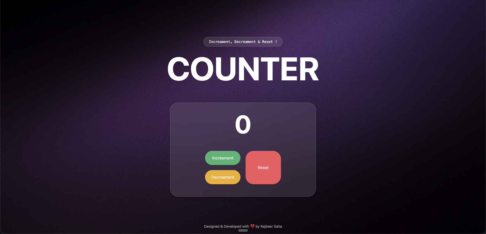

# 🔢 Basic Counter



A sleek, interactive counter application built with HTML, CSS (Tailwind), and vanilla JavaScript. Features a modern glassmorphism design with smooth animations and keyboard controls.

   

## ✨ Features

### 🎯 Core Functionality
- **Increment Counter**: Increase the count by 1
- **Decrement Counter**: Decrease the count by 1 (with negative protection)
- **Reset Counter**: Reset the count back to 0
- **Negative Count Protection**: Counter won't go below 0

### 🎨 Visual Features
- **Modern Glassmorphism UI**: Beautiful transparent design with backdrop blur
- **Smooth Animations**: Scale animation on number changes
- **Responsive Design**: Works seamlessly across different screen sizes
- **Custom Background**: Aesthetic background image with overlay

### ⌨️ Keyboard Controls
- **Arrow Up (↑)**: Increment counter
- **Arrow Down (↓)**: Decrement counter  
- **Shift**: Reset counter to 0

### 🎭 Interactive Elements
- **Button Hover Effects**: Scale animations on hover
- **Active State Feedback**: Scale-down effect on button press
- **Smooth Transitions**: All interactions include smooth CSS transitions

## 🚀 Live Demo

[View Live Demo](https://pixelpioneer404.github.io/Basic-Counter/) *(Replace with your GitHub Pages URL)*

## 🛠️ Technologies Used

- **HTML5**: Semantic markup structure
- **CSS3**: Styling with modern features
- **Tailwind CSS**: Utility-first CSS framework
- **JavaScript**: Vanilla JS for interactivity
- **Glassmorphism**: Modern design trend implementation

## 📋 Installation & Setup

1. **Clone the repository**
   ```bash
   git clone https://github.com/PixelPioneer404/Basic-Counter.git
   cd Basic-Counter
   ```

2. **Open in browser**
   ```bash
   # Simply open index.html in your preferred browser
   open index.html
   # or
   python -m http.server 8000  # For local server
   ```

3. **No build process required** - It's a static website!

## 📁 Project Structure

```
Basic-Counter/
├── index.html          # Main HTML file
├── script.js           # JavaScript functionality
├── output.css          # Compiled Tailwind CSS
├── assets/
│   └── bg.png         # Background image
└── README.md          # Project documentation
```

## 🎮 How to Use

### Mouse/Touch Controls
1. Click **"Increment"** button to increase the counter
2. Click **"Decrement"** button to decrease the counter
3. Click **"Reset"** button to reset counter to 0

### Keyboard Controls
1. Press **↑** (Arrow Up) to increment
2. Press **↓** (Arrow Down) to decrement
3. Press **Shift** to reset

## 🔧 Code Highlights

### Negative Count Protection
```javascript
function decrease() {
    count -= 1
    // Ensures display never shows negative numbers
    countDisplay.textContent = Math.max(0, count)
}
```

### Smooth Number Animation
```javascript
function increase() {
    // Scale down animation
    countDisplay.style.transform = 'scale(0.8)'
    setTimeout(() => {
        countDisplay.textContent = count
        // Scale back to normal
        countDisplay.style.transform = 'scale(1)'
    }, 150)
}
```

### Keyboard Event Handling
```javascript
document.addEventListener('keydown', (e) => {
    if (e.key === "ArrowUp") {
        e.preventDefault()
        increase()
    }
    // Additional keyboard controls...
})
```

## 🎨 Design Features

- **Glassmorphism Effect**: `bg-white/10 backdrop-blur-3xl border border-white/20`
- **Smooth Transitions**: `transition-all duration-300 ease-in-out`
- **Interactive Buttons**: Hover and active state animations
- **Typography**: Modern font hierarchy with Sans-serif fonts
- **Color Scheme**: Dark theme with colorful accent buttons

## 🚀 Future Enhancements

- [ ] Add sound effects for button clicks
- [ ] Implement step increment/decrement (e.g., +5, +10)
- [ ] Add counter history/undo functionality  
- [ ] Theme customization options
- [ ] Local storage to persist counter value
- [ ] Counter limits (min/max values)
- [ ] Multiple counter instances

## 🤝 Contributing

1. Fork the repository
2. Create your feature branch (`git checkout -b feature/amazing-feature`)
3. Commit your changes (`git commit -m 'Add some amazing feature'`)
4. Push to the branch (`git push origin feature/amazing-feature`)
5. Open a Pull Request

## 📄 License

This project is open source and available under the [MIT License](LICENSE).

## 👨‍💻 Author

**Rajbeer Saha**
- GitHub: [@PixelPioneer404](https://github.com/PixelPioneer404)
- Portfolio: [Your Portfolio URL]

---

⭐ **If you found this project helpful, please give it a star!** ⭐

---

*Designed & Developed with ❤️ by Rajbeer Saha*